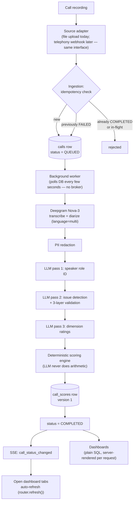
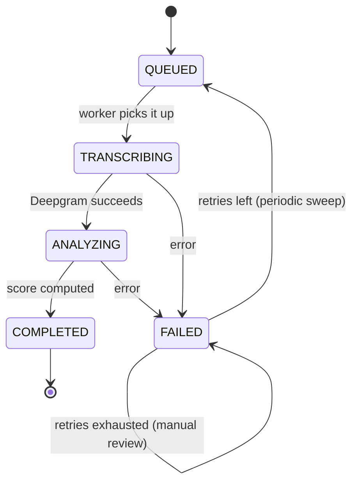
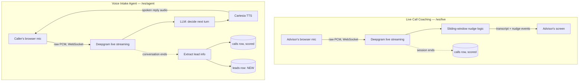
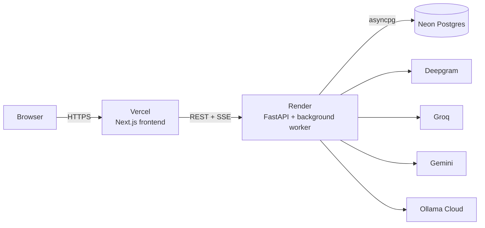
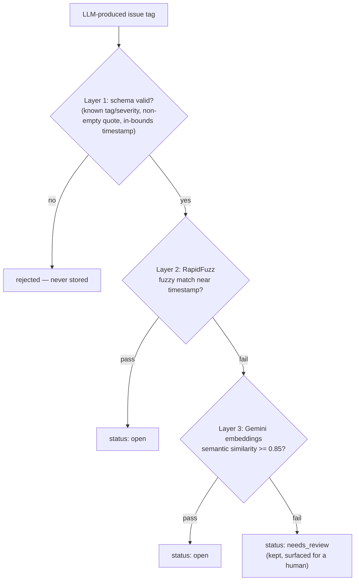
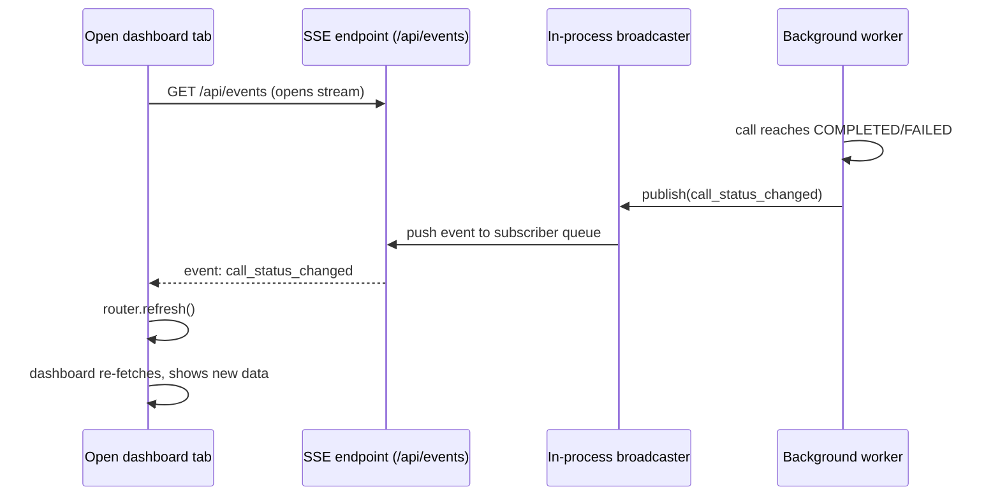

# FitNova — Sales-Call Intelligence System

An AI pipeline that ingests recorded sales calls, transcribes and diarizes them, runs a
3-pass LLM analysis (speaker roles, compliance/quality issues, dimension ratings),
computes a deterministic score, and surfaces all of it through director/team-leader/advisor
dashboards with a live contest-and-review workflow. Two real-time voice-AI pipelines sit
alongside the batch-scoring core: a live coaching companion that nudges an advisor mid-call,
and a voice agent that runs its own qualification calls and hands off what it learns as a
trackable Lead.

A personal project built at production-level care rather than as a quick demo —
real tests, real error handling, real failure-path recovery, not just a happy path.

**Live:**
- Frontend: https://fitnova-ai-call-auditor.vercel.app
- Backend API: https://fitnova-backend-t1nz.onrender.com/api/health

## What's in it

- **Director / Team Leader / Advisor dashboards** — org-wide health, team coaching queues,
  an advisor's own scorecard. Score trend charts with a 4/8/12-week range selector.
- **All Calls page** — a filterable, paginated log (advisor, team, status, call type, issue
  tag, score range, date range), URL-driven so filtered views are shareable links.
- **Call detail page** — diarized transcript with an audio player synced to it (click a
  timestamp, it seeks), per-tag issue cards, dimension ratings, full score version history.
- **Contest / confirm / dismiss workflow** — an advisor can contest a flagged issue; a team
  leader confirms or dismisses it; a dismissal triggers a live score recalculation, versioned
  (scores are never overwritten, only ever appended).
- **Live updates** — an SSE stream pushes "a call finished processing" to every open
  dashboard tab, which re-fetches in place (no polling, no manual reload needed).
- **Upload page** — demo entry point standing in for a real telephony webhook; shows genuine
  live pipeline progress (not a fake progress bar — see [Design decisions](#design-decisions)).
- **Live Call Coaching (`/live`)** — a real-time companion for a call already happening
  through some other means: streams the advisor's mic to Deepgram's *live* (not batch) API
  over a WebSocket and surfaces short coaching nudges as the conversation unfolds. When the
  session ends it's persisted and scored exactly like an uploaded recording.
- **Voice Intake Agent (`/agent`)** — the AI runs one side of the conversation itself: listens,
  decides what to say via an LLM, and speaks it back with Cartesia TTS, including barge-in
  (stops talking if the caller interrupts). When the call finishes, the transcript is scored
  *and* structured lead info (name, phone, goal, health notes, availability, confirmed time)
  is extracted into a new Lead — the agent's real hand-off, not just a spoken promise.
- **Leads (`/leads`)** — every Lead the voice agent creates, assignable to an advisor and
  tracked through `NEW -> ASSIGNED -> CONTACTED -> TRIAL_BOOKED`. An assigned lead links
  straight to `/live` with that advisor pre-selected, connecting the AI's qualification call
  to the human follow-up call it hands off to.

## Architecture



LLM calls (all 3 passes) go through a provider fallback chain — Groq (primary) -> Gemini ->
Ollama Cloud — so one provider's outage doesn't fail a call outright.

### Call processing state machine

The whole pipeline above lives as a `status` column on one `calls` row, driven by a
background worker polling for `QUEUED` rows — not a message broker. A periodic sweep
recovers calls stuck past a timeout and requeues failed ones under a retry cap:



### Real-time voice pipelines

Two separate WebSocket endpoints, sharing no state with the batch pipeline above and with
each other — neither writes an audio file to disk; only the resulting transcript is ever
persisted, as a `calls` row scored the same way an uploaded recording would be.



## Tech stack

| Layer | Choice |
|---|---|
| Backend | FastAPI (async), SQLAlchemy 2.0 (async), asyncpg, Alembic, Neon Postgres |
| Frontend | Next.js 14 (App Router), TypeScript, Tailwind, Recharts |
| Transcription | Deepgram Nova-3 (STT + diarization, batch and live streaming) |
| LLM | Groq -> Gemini -> Ollama Cloud fallback chain (no LangChain/LiteLLM — a thin provider abstraction) |
| Voice agent TTS | Cartesia (LLM reply text -> spoken WAV, `services/tts.py`) |
| Tag validation | Pydantic schema + RapidFuzz fuzzy match + Gemini embeddings (semantic similarity) |
| Live updates | Server-Sent Events, in-process pub-sub (no Redis at this scale) |
| Audio storage | Local disk (transcription) + Backblaze B2, S3-compatible API (durable backup, optional) |
| Backend host | Render |
| Frontend host | Vercel |

## Running it locally

```bash
# Backend
cd backend
python -m venv venv && source venv/Scripts/activate   # or venv/bin/activate on Mac/Linux
pip install -r requirements.txt
cp ../.env.example .env   # fill in DATABASE_URL + API keys, see below
alembic upgrade head      # or just start the app — it self-migrates on boot too
python ../scripts/seed_db.py
uvicorn app.main:app --reload --port 8000

# Frontend (separate terminal)
cd frontend
npm install
cp ../.env.example .env.local   # keep only the NEXT_PUBLIC_API_URL line
npm run dev
```

Visit `http://localhost:3000`. `/live` and `/agent` need real microphone access (browser
prompts for it), so they only work over `localhost` or HTTPS, not a bare `http://` LAN IP.

To see real (not backfilled) data flowing through the pipeline, generate and process the 6
synthetic sample calls:
```bash
python scripts/generate_sample_calls.py     # edge-tts synthetic voices, ~2 min
python scripts/process_all_samples.py       # uploads + polls each through the real pipeline
python scripts/seed_score_history.py        # optional: backdates 6 weeks of history per call, for the trend charts
```

### Environment variables

See `.env.example` for the full list with defaults. The ones with no default that you must
supply: `DATABASE_URL` (Neon connection string), `DEEPGRAM_API_KEY`, `GROQ_API_KEY`,
`GEMINI_API_KEY` (also powers tag-validation embeddings, not just the LLM fallback),
`OLLAMA_API_KEY`, and `NEXT_PUBLIC_API_URL` for the frontend. The four `B2_*` vars are
optional — leave them blank to run without durable audio backup (see "Durable audio
storage" under Design decisions). `CARTESIA_API_KEY` is also optional — leave it blank and
the voice agent (`/agent`) still runs, just text-only (no spoken replies); `/live` doesn't
use TTS at all and is unaffected either way.

### Optional: local Postgres instead of Neon

`docker-compose.yml` spins up a local Postgres if you'd rather not use Neon while
developing — not required, the project defaults to Neon everywhere.

## Testing

```bash
cd backend
pytest -q
```

35 tests, all integration-style against the real dev DB (throwaway rows, cleaned up per
test) rather than mocks — deliberately, so a real `TranscriptionError` (file genuinely
missing) drives the failure path exactly as the background worker would hit it in
production. A couple of the tag-validation tests make a real call to Gemini's embedding
API (only the ones where fuzzy match is expected to fail — see below), so they need
`GEMINI_API_KEY` set and network access.

The two real-time voice pipelines have their own simulation-based evals — not part of the
`pytest` suite, run by hand against a real running server, since each one drives a real
WebSocket connection with real synthesized audio (edge-tts) rather than a mock:

```bash
# Terminal 1
uvicorn app.main:app --host 127.0.0.1 --port 8000

# Terminal 2
python scripts/eval_live_call.py       # coaching-nudge pipeline: latency, transcript accuracy
python scripts/eval_voice_agent.py     # full conversation: turn-taking, lead extraction
```

Each burns real Deepgram/LLM/(Cartesia, for the agent) quota — not something to loop or run
in CI. Results append to `scripts/eval_results_live.json` / `eval_results_voice_agent.json`
for tracking regressions over time.

## Deployment

Backend on Render, frontend on Vercel, DB already on Neon. Both auto-deploy from this
repo's `main` branch.



**Backend (Render)**: `render.yaml` in the repo root is a Blueprint — "New +" -> "Blueprint"
in Render, connect the repo, it reads build command / start command / health check path
from that file. You still need to fill in the secrets it leaves blank (`sync: false`):
`DATABASE_URL`, `DEEPGRAM_API_KEY`, `GROQ_API_KEY`, `GEMINI_API_KEY`, `OLLAMA_API_KEY`,
`FRONTEND_URL`, and the four `B2_*` vars (optional — omit them to run without durable
audio backup).

**Frontend (Vercel)**: import the repo, set **Root Directory** to `frontend`, set
`NEXT_PUBLIC_API_URL` to the Render backend's URL. Redeploy after changing it — Next.js
bakes `NEXT_PUBLIC_*` vars into the client bundle at build time, so just saving the env
var without a fresh deploy leaves the old value in the already-built JS.

**After both are up**: go back to Render and set `FRONTEND_URL` to the real Vercel URL,
then redeploy the backend. CORS checks this for an exact match (scheme, no trailing
slash) — until it's set correctly, the dashboard's server-rendered parts will work (that's
a server-to-server fetch, not subject to browser CORS) but the sidebar's team/advisor
lists will silently fail (client-side fetch, blocked by CORS, caught into a
`console.error` with no visible banner) — the specific symptom that flagged this exact
misconfiguration during this project's own deploy.

Three real gotchas hit during this project's actual deploy, left here since they're not
obvious from the code:
1. **Render defaults to a very new Python** (3.14 at time of writing) with no prebuilt
   wheel yet for `rapidfuzz`, and its source-build fallback fails on a `pyproject.toml`
   strictness bug unrelated to this project. Fixed by pinning `PYTHON_VERSION=3.10.13` in
   `render.yaml` — matching what's actually been tested, not just "anything newer."
2. **Monorepo root directory**: since `git init` was run inside `fitnova/` itself, that
   directory *is* the repo root — `render.yaml`'s `rootDir` and Vercel's Root Directory
   setting are both just `backend` / `frontend`, not `fitnova/backend` / `fitnova/frontend`.
3. **Migrations self-run on boot** (`alembic upgrade head`, as a subprocess, before the
   worker starts — see `main.py`'s lifespan) specifically so there's no separate manual
   migration step to forget on a host like Render's free tier that doesn't offer a
   reliable pre-deploy hook.

## Design decisions

**Adapter pattern for call ingestion.** `BaseSourceAdapter.normalize()` maps any vendor's
payload (telephony webhook, CRM export, manual upload) onto one internal `CallEvent`
shape. Only `FileUploadAdapter` exists today; a real telephony integration is a new file,
zero changes anywhere downstream.

**Idempotency, not just insert.** `UNIQUE(source_system, external_id)` plus explicit status
handling: `COMPLETED` -> reject (already processed), in-flight -> reject (already being
worked on), `FAILED` -> allow retry (resets `retry_count`, accepts a corrected `audio_ref`).
Stops a webhook firing twice from double-processing a call.

**3-pass LLM analysis, each pass narrow and validated.** Speaker role ID, issue detection,
dimension ratings run as separate calls (not one call trying to think about everything at
once) at `temperature=0`, each schema-validated before the next step touches the output.

**3-layer tag validation** — an issue tag is never trusted just because the LLM said so:



1. Pydantic schema (right shape, known tag/severity, non-empty quote, in-bounds timestamp)
2. RapidFuzz (does the quoted text roughly appear in the transcript near that timestamp?)
3. Gemini embeddings, semantic similarity — catches genuine paraphrases fuzzy match misses
   (e.g. "offer expires tomorrow" vs "offer ends tomorrow"), only called when Layer 2
   already failed (a fuzzy pass already validates the tag — skip the network round-trip).
   Originally a local `sentence-transformers` model; swapped to Gemini's hosted embedding
   API for the deploy (`torch` alone is ~1-2GB installed and 300-500MB+ resident once
   loaded — real risk of not fitting a free-tier host, and this reuses the Gemini key/SDK
   already in the project rather than adding a new dependency). `SEMANTIC_THRESHOLD` was
   recalibrated empirically for the new embedding space (0.75, tuned for the old model,
   would have wrongly passed unrelated text under the new one — see
   `services/validation.py`'s module docstring for the actual measured scores).

A tag passes if it clears Layer 1 **and** at least one of (Layer 2, Layer 3).
Schema-pass-only -> `needs_review` (kept, surfaced for a human — never silently dropped).

**Deterministic scoring — the LLM never does arithmetic.** Dimension ratings feed a
weighted base score; validated issue tags apply severity-based deductions,
deduplicated by tag type (a real bug: duplicate tag instances were stacking deductions
before this).

**Scores and prompts are versioned, never overwritten.** A dismiss/confirm decision that
changes the deduction inserts a new `call_scores` row (never updates the old one) plus a
`score_audit_log` entry recording who/why. Prompt text is versioned in the DB with an
`is_active` flag — a rubric change is a new version, not a silent edit of one already
referenced by real scored calls.

**State machine in a DB column, not a broker.** `QUEUED -> TRANSCRIBING -> ANALYZING ->
COMPLETED/FAILED` lives in `calls.status`; a background `asyncio` task polls for `QUEUED`
rows every few seconds. No Celery/Redis — for a single-process worker, a distributed
queue would add infrastructure without demonstrable benefit at this scale; swapping the
executor later doesn't change the schema. A periodic sweep recovers calls stuck past a
timeout and requeues failed ones under a retry cap.

**Live progress is in-memory, not a DB write — deliberately.** The Upload page's
step-by-step progress used to write `calls.current_step` in its own committed transaction,
on the theory that a separate connection can't see this session's uncommitted flushes.
True, but that UPDATE targets the exact row the worker holds under
`SELECT ... FOR UPDATE` for the pipeline's entire duration — Postgres blocks a conflicting
write from another connection until that lock releases, so the "independent commit" would
just hang until the pipeline finished anyway (confirmed by directly reproducing the block
during this project's own build). Progress reporting doesn't need to survive a process
restart — it only needs to be visible within one running process — so it's a plain
in-memory map instead, same pattern as the SSE broadcaster right next to it.

**SSE over polling or WebSockets for live dashboard updates.** Data only ever flows
server -> client here (a call finished, please refresh) — nothing the client needs to send
back — so a one-directional stream fits better than a full-duplex WebSocket, and pushing on
an actual state change beats polling on a timer:



No Redis: the worker and the API share one process, so an in-process `asyncio.Queue` per
subscriber is enough at this scale; it would need a real broker the moment there's more
than one backend instance.

**Durable audio storage as a second field, not a replacement.** `Call.audio_ref` (the
local path transcription reads) and `Call.audio_backup_ref` (a durable `b2:{key}`
reference, once a Backblaze B2 upload succeeds) are deliberately separate columns rather
than making the local path durable-or-nothing. Transcription always happens moments after
upload, long before any restart could occur, so it never needs the durable copy — keeping
it on a local path means the proven-working transcription code path is literally untouched
by this. The audio-serving endpoint tries the local file first (fast, no extra round-trip)
and only reaches for a presigned B2 URL — a `307` redirect, not a proxy — if the local copy
is gone. The B2 upload itself is best-effort: any failure (not configured, network error,
bad credentials) just leaves `audio_backup_ref` `NULL` and the call proceeds exactly as it
would have without B2 at all, since durability here is additive, never load-bearing for the
pipeline itself. One real bug hit wiring this up: boto3 defaults to the legacy SigV2
presigned-URL format against a non-AWS endpoint when it can't confidently infer a signing
region, and B2 rejects that format outright as `UnauthorizedAccess` rather than a clear
signature error — fixed by explicitly forcing `Config(signature_version="s3v4")` and
parsing the region straight out of the B2 endpoint hostname.

**Two color systems, not one — status and identity never share a hue.**
`app/globals.css` defines everything as CSS custom properties (`--surface-*`,
`--text-*`, `--border`, `--status-*`), light by default and swapped by both
`prefers-color-scheme` and an explicit `data-theme` override. On top of that
sit two independent, deliberately non-overlapping palettes:
- **Status roles** (`--status-good/warning/serious/critical`) are semantic —
  red always means critical, green always means good, everywhere a `Badge`
  appears (call status, score, issue severity, lead pipeline stage).
- **Identity colors** (`--cat-1..5`, violet/indigo/sky/pink/fuchsia) are
  assigned per entity via `categoryColorVar(seed)` in `lib/utils.ts` — a
  stable hash of a team/advisor/tag-type ID always lands on the same hue,
  so an advisor's avatar, sidebar entry, and chart series all agree without
  passing color props around. The two sets share no hues on purpose: an
  advisor's identity color must never be mistaken for a severity warning.

Dark mode uses a warm charcoal (`#171412` family, a faint brown undertone)
rather than neutral near-black, plus a single interactive accent (teal,
`--series-1`) reserved for links, focus rings, and "this is live right now"
— everything else stays neutral so the one thing that should draw the eye
actually does.

**Dense tables: hover-lift, not zebra striping.** `CallsTable` and
`LeadsTable` use thin row rules and a subtle background tint on hover to
help the eye track across a row, instead of alternating row colors — zebra
striping is what makes a data table read as a spreadsheet dump rather than
a product surface. Status is a small inline dot next to the text it
describes (not a separate colored column), and every score gets a thin
inline magnitude bar alongside the number, not just a color band, so scale
reads before you even parse the digits.

**The live-call glow is color displacement, not a blinking dot.** `/live`'s
transcript panel stays neutral until a call is actually live, then gets a
soft accent-colored glow (brighter still while speech is detected) —
contrast, not decoration, signals "this is happening now." The mic level
meter next to it is real: a Web Audio `AnalyserNode` tapped off the same
stream sent to Deepgram, not a decorative pulse animation.

## What's real vs. what's simplified

Being direct about this rather than letting it blend in:

- **Advisor identity is metadata, not a voiceprint.** "Priya Sharma made this call" comes
  from `Call.advisor_id`, asserted at ingestion (the way a real CRM/dialer would tell you
  which advisor's queue placed the call) — never inferred from the audio. What genuinely
  *is* inferred per call is which anonymous diarized `Speaker 0/1` is playing the advisor
  role, via the speaker-ID LLM pass. Nothing cross-checks that the voice on the recording
  actually matches the named advisor — a real gap if upstream metadata were ever wrong.
- **Audio storage is local disk plus a durable B2 backup**, not local-disk-only. Render's
  filesystem is still ephemeral — a redeploy or restart wipes `UPLOAD_DIR` exactly like
  before — but every new upload is now also copied to Backblaze B2 (S3-compatible API) as
  `Call.audio_backup_ref`, kept as a field separate from `audio_ref` on purpose (see
  "Durable audio storage" below). `backend/sample_calls/*.wav` (the 6-call demo dataset)
  never needed this — committed to the repo, survives every redeploy on its own. B2 itself
  is optional at the code level: with its env vars unset, `services/audio_storage.py`
  degrades every call to a no-op and the app behaves exactly as it did before this existed.
  Uploading anything other than the 6 committed sample calls means it goes through the
  full pipeline for real — Deepgram + 3 real LLM calls — burns real API quota, worth
  knowing before a reviewer clicks around.
- **Single-process assumptions**: the SSE broadcaster and the in-memory progress map both
  only work within one running backend process. Fine at this scale (Render's free/starter
  tier runs one instance); would need Redis pub-sub the moment there's more than one.
- **No real telephony adapter.** The Upload page is a deliberate stand-in for what a
  webhook from a telephony vendor would do automatically.
- **The voice agent doesn't place or receive phone calls.** `/agent` and `/live` both speak
  raw PCM over a browser WebSocket (a mic, not a phone line) — there is no Twilio/Vonage-style
  bridge connecting either endpoint to the PSTN, and nothing schedules or originates a call
  automatically. In a real deployment, a telephony provider would need to answer or place the
  actual call and bridge its audio into the same WebSocket protocol already built; everything
  *after* that bridge (transcription, the conversational loop, TTS, lead extraction, scoring)
  is real and already working exactly as it would with a phone caller instead of a mic.
- **Score history before this week is synthetic.** `seed_score_history.py` backdates 6
  weeks of jittered scores per real scored call purely so the trend charts have more than
  one data point to draw a line through — clearly separated by `source_system="seed_backfill"`
  (never `"file_upload"`), reset to a clean `open` tag state (no fake contest history). It's
  random noise around each call's real score, not an invented trend.

## What's next

- **Telephony bridge for `/live` and `/agent`** — the largest real gap: wiring in a provider
  (Twilio, Vonage) to answer/place actual phone calls and bridge that audio into the existing
  WebSocket protocol, plus a scheduler/dialer for outbound and consent/compliance handling.
  Separate infrastructure work, not a voice-AI or scoring problem.
- **Deepgram transcribe-by-URL** — transcription still reads the local copy of a fresh
  upload (see "Durable audio storage" below for why that's deliberate and low-risk); once
  B2 has a permanent copy, pointing Deepgram at a presigned URL directly would mean the
  local write in `UPLOAD_DIR` could go away entirely — one less ephemeral thing to reason
  about, not required for correctness today.
- **Neon's pooled (`-pooler`) connection endpoint** — the direct endpoint was used
  throughout; a workload with many short-lived connections (exactly this app's shape) is
  what Neon's pgbouncer pooling is meant for, and would reduce a real class of connection
  flakiness observed during heavy concurrent testing this session.
- **Voiceprint verification** — cross-check that the recorded voice actually matches the
  advisor named in ingestion metadata, closing the identity gap noted above.
- **Redis-backed SSE broadcast + progress store** — needed the moment the backend runs as
  more than one instance; today's in-memory versions are explicitly single-process.
- **Granular retry/backoff per failure type** — right now any exception in the pipeline
  gets the same flat retry treatment; a rate-limited LLM call and a genuinely malformed
  audio file probably deserve different handling.

## Project structure

```
fitnova/
  backend/
    app/
      adapters/       # source-agnostic ingestion (file_upload.py, live_call.py, voice_agent.py)
      llm/            # provider abstraction (Groq/Gemini/Ollama), fallback chain
      models/         # SQLAlchemy ORM (lead.py: the voice agent's hand-off record)
      routers/        # FastAPI endpoints (live.py, voice_agent.py: WebSocket; leads.py: REST)
      schemas/        # Pydantic request/response + LLM output shapes
      services/       # ingestion, transcription, analysis, validation, scoring, processor
                       # (worker), events (SSE + progress), audio_storage (B2), live_call.py
                       # (coaching-nudge logic), voice_agent.py (conversation loop + lead
                       # extraction), tts.py (Cartesia)
    alembic/versions/  # schema migrations
    sample_calls/      # the 6 committed demo audio files + manifest.json
    scripts/           # eval_issue_detection.py, eval_live_call.py, eval_voice_agent.py —
                        # simulation-based evals against the real running server, no mocks
    tests/
  frontend/
    src/
      app/            # Next.js App Router pages (dashboards, call detail, calls log, upload,
                       # live, agent, leads)
      components/     # dashboard/, call/, calls/, layout/, ui/, live/, agent/, leads/
      lib/            # api client, types, formatting helpers
  scripts/            # generate_sample_calls.py, process_all_samples.py, seed_db.py, seed_score_history.py, upgrade_prompt.py
  render.yaml         # Render Blueprint (backend)
  docker-compose.yml  # optional local Postgres, not required (defaults to Neon)
```
